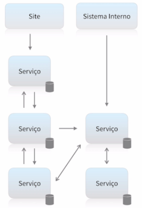

# **Introdução a Microsserviços**

-   Disponibiliza informação;
-   Realiza transações;
-   Resolve problemas de negócio;
-   Independe de tecnologia ou produto;
-   Pode estabelecer comunicação com diversos clientes;

## **SOA - Arquitetura Orientada a Serviços**

-   Serviços normalmente maiores baseados em funcionalidade;
-   Necessidade de ESB;
-   Single point of failure;
-   Compartilhamento de bancos de dados é comum;
-   Não é Microsserviços, mas ajudou a dar origem.

## **Arquitetura Baseada em Microsserviços**

-   Não existe um poder centralizador, como o ESB;
-   Serviços pequenos com poucas responsabilidades;
-   Maior tolerância a falhas;
-   Totalmente independentes;
-   Cada serviço possui seu próprio banco de dados;
-   Comunicação síncrona ou assíncrona;

### Microsserviços não são para todas as situações:

-   Arquitetura complexa;
-   Custo de infraestrutura maior;
-   Necessidade de mais equipes para manter;
-   Sistema ser grande o suficiente para justificar;
-   Gera problemas que você não tinha antes;
-   Monitoramento complexo.