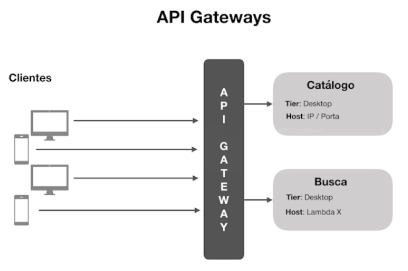
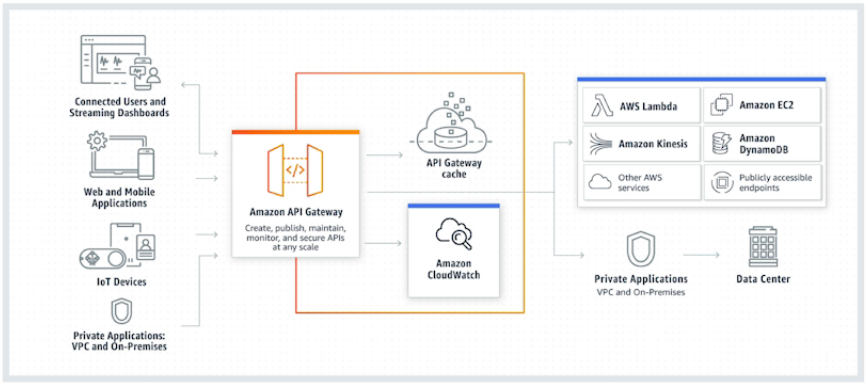

# **API Gateways**

>   Recebe todas as chamadas de APIs dos clientes e então roteia para os microserviços correspondentes. E em alguns casos, por realizar processos de verificação de segurança, como autenticação e autorização.

## Exemplo de API Gateway na AWS

