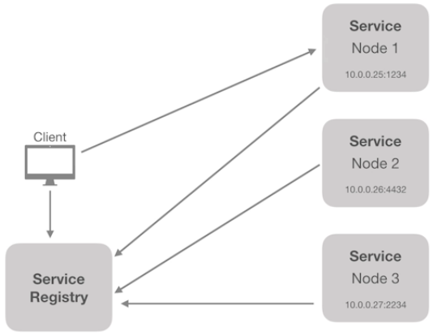
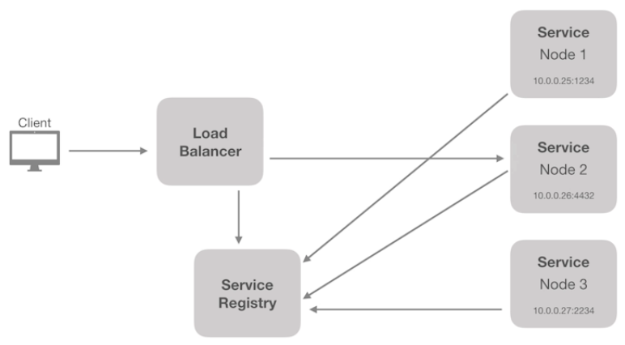

# **Service Discovery**

> É responsável por prover mecanismos de identificação dos serviços disponíveis e suas instâncias.

## **Client Side**

## **Server Side**

## **Ferramentas Populares**

-   Netflix Eureka;
-   Consul;
-   Etcd;
-   ZooKeeper.

> O processo de Service Discovery já estará sendo aplicado automaticamente ao utilizar o Kubernetes, pois ao acionar o Load Balance, este por sua vez vai identificar o Pod disponível do serviço.