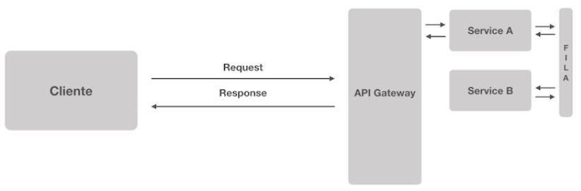

# **Comunicação entre Microsserviços**

A comunicação entre Microsserviços podem ocorrer de duas formas:

## **Síncrona**

> Porém em alguns casos o processo pode ficar travado.

## **Assíncrona**

> Mesmo que o Microsserviço B esteja fora do ar, a requisição não vai se perder, pois estará armazenado no sistema de Mensageria.

## **Exemplo de Dupla Latência**

> Em microsserviços não é obrigatório o uso de de filas e comunicação assíncrona, tudo vai depender do tempo de processamento entre requisição e resposta.