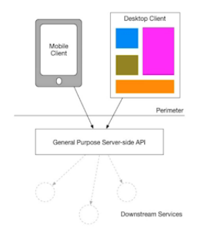
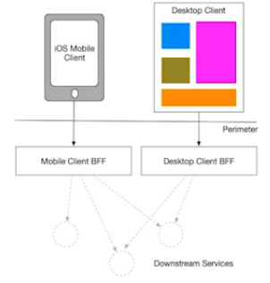

# **BFF - Backend for Frontend**

Não é uma boa prática quando o Backend serve as mesmas informações para diferentes tipos de Frontend (PC, mobile, etc.) sendo que nem todos vão utilizar 100% disso, podendo sobrecarregar o client.

Com a abordagem BFF, haverá uma camada Backend para cada tipo de dispositivo, que ficará responsável por fornecer apenas as informações necessárias para o dispositivo.

