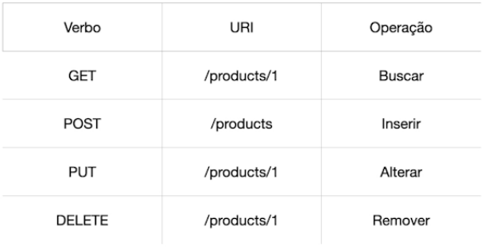
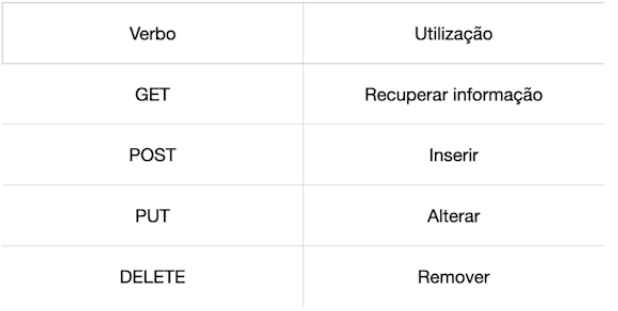
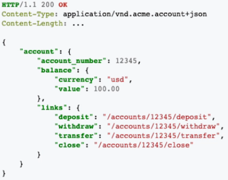

# **REST - Represetational State of Transfer**

-   Surgiu em 2000 por Roy Fielding;
-   Simplicidade;
-   Stateless:
    -   Não mantém o estado/sessão, por conta disso em muitos casos é necessário passar formas de identificação, como Tokens.
-   Cacheável;

## **Níveis de Maturidade (Richardson Maturity Model)**

-   Nível 0: The Swamp of POX:

        Parte do princípio de que tudo que for trafegado por HTTP é realizado uma transação, como inserir um dado no banco de dado, ou executar uma função, sem uma padronização.

-   Nível 1: Utilização de resources:
    
    

-   Nível 2: Verbos HTTP:

    

-   Nível 3: HATEOAS: Hypermedia as the Engine of Application State:
        
        Sempre vai responder sua solicitação informando o que mais é possível realizar nesse serviço. Tornando assim o serviço auto explicativo.
        
    
