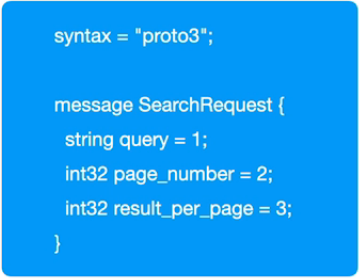
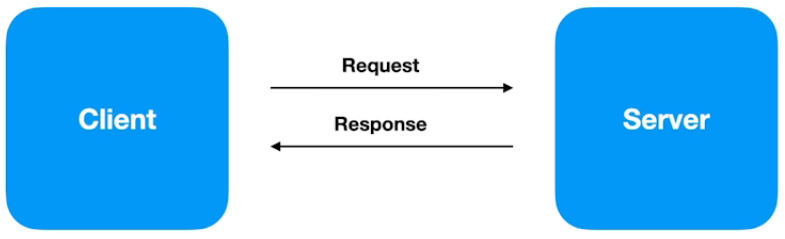
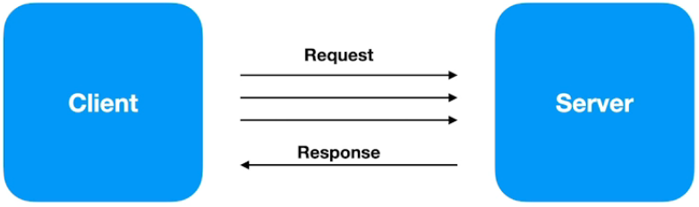
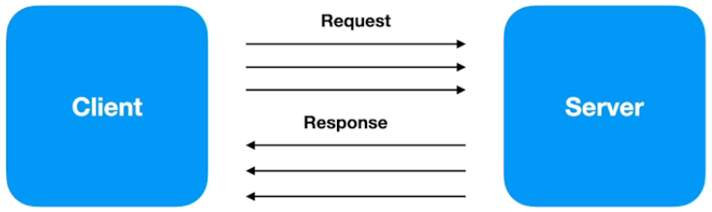

# **gRPC - Remote Procedure Call**

    É um framework desenvolvido pela Google com o objetivo de facilitar a comunicação entre sistemas, independente de linguagem.

## **Quando usar?**

-   Ideal para microsserviços;
-   Mobile, Browsers e Backend;
-   Geração das bibliotecas de forma automática;
-   Streaming bidirecional utilizando HTTP/2.

## **Linguagens com suporte oficial**

-   GO;
-   Java;
-   C:
    -   C++;
    -   Python;
    -   Ruby;
    -   Objective C;
    -   PHP;
    -   C#;
    -   Node.js;
    -   Dart;
    -   Kotlin / JVM.

## **Protocol Buffers**

-   Neutra de linguagem e Plataforma;
-   Extensível;
-   Serializa estrutura de dados.

## **Protocol Buffers vs JSON**

-   Arquivos binários < JSON (text);
-   Processo de serialização é mais leve (CPU) do que JSON;
-   Gasta menos recurso de rede;
-   Processo mais veloz que em JSON.

## **HTTP/2**

-   Lançado em 2015;
-   Dados trafegados são binários;
-   Utiliza a mesma conexão TCP para enviar e receber dados do cliente e do servidor (Multiplex);
-   Server Push;
-   Headers são comprimidos;
-   Gasta menos recurso de rede;
-   Processo mais veloz.

## **gRPC - API "unary"**

## **gRPC - API "Server streaming"**

## **gRPC - API "Client streaming"**

## **gRPC - API "Bi direcional streaming"**

