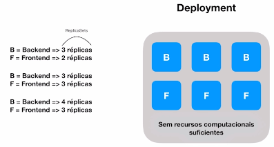

# **Introdução ao Kubernetes**
> Open Source para automatizar a implantação, o dimensionamento e gerenciamento de aplicações em contêiner.

## Pontos importantes
- Kubernetes é disponibilizado através de um conjunto de APIs;
- Normalmente o acesso a essas APIs é através do CLI ***kubectl***;
- Tudo é baseado em estado;
- Kubernetes Master:
    - Kube-apiserver;
    - Kube-controller-manager;
    - Kube-scheduler.
- Outros Nodes:
    - Kubelet;
    - Kubeproxy.

## Dinâmica Superficial

-  Cluster:
    - Conjunto de máquinas (nodes);
    - Cada um possui suas especificações de CPU e memória;
    - O K8s tem a visão da quantidade total de processamento disponível e de como vai disponibilizar os recursos neles.
- Pod:
    - Unidade que contém o container provisionado;
    - Representa um processo rodando no cluster.
- Deployment:
    - Provisiona os Pods no clustes;
    - Define a quantidade de réplicas do Pod (***ReplicaSets***);

