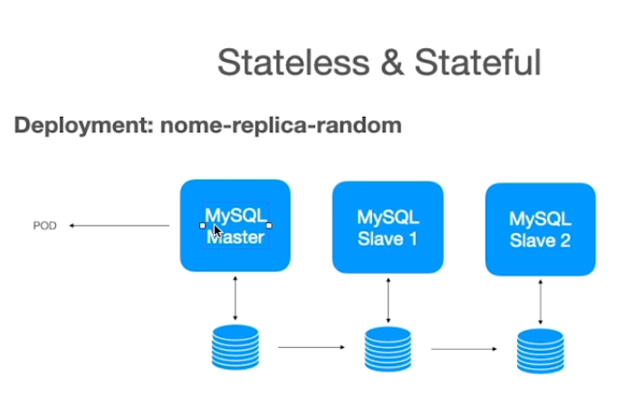

# **Introdução ao Kubernetes**
> Open Source para automatizar a implantação, o dimensionamento e gerenciamento de aplicações em contêiner.

## Pontos importantes
- Kubernetes é disponibilizado através de um conjunto de APIs;
- Normalmente o acesso a essas APIs é através do CLI ***kubectl***;
- Tudo é baseado em estado;
- Kubernetes Master:
    - Kube-apiserver;
    - Kube-controller-manager;
    - Kube-scheduler.
- Outros Nodes:
    - Kubelet;
    - Kubeproxy.

## Dinâmica Superficial

-  Cluster:
    - Conjunto de máquinas (nodes);
    - Cada um possui suas especificações de CPU e memória;
    - O K8s tem a visão da quantidade total de processamento disponível e de como vai disponibilizar os recursos neles.
- Pod:
    - Unidade que contém o container provisionado;
    - Representa um processo rodando no cluster.
- Deployment:
    - Provisiona os Pods no clustes;
    - Define a quantidade de réplicas do Pod (***ReplicaSets***);


## Replicasets
Objeto que gerencia os pods, criando replicas e monitorando os pods no intuito de manter todos em funcionamento.
Caso a imagem Docker utilizada seja atualizada, os pods criados pelo replicasets só irão subir a nova versão após derrubar os pods atuais e gerar novos. Para contornar isso, usamos o Deployment.

## Deployment
Gerencia de forma automatica os ReplicaSets, para que todos estejam rodando as mesmas versões da imagem Docker. O Deployment não exclui o ReplicaSet antigo.

## Service
É a porta de entrada da nossa aplicação. Disponibiliza a aplicação para ser acessado.
Se utiliza da *matchLabels* presente no arquivo do Deployment para realizar essa ligação com o Service.

### Tipos de Service:
- ClusterIP (padrão) - Expõe o serviço sob um endereço IP interno no cluster. Este tipo faz do serviço somente alcançável de dentro do cluster.

- NodePort - Expõe o serviço sob a mesma porta em cada nó selecionado no cluster usando NAT. Faz o serviço acessível externamente ao cluster usando <NodeIP>:<NodePort>. Superconjunto de ClusterIP.

- LoadBalancer - Cria um balanceador de carga externo no provedor de nuvem atual (se suportado) e assinala um endereço IP fixo e externo para o serviço. Superconjunto de NodePort.

- ExternalName - Expõe o serviço usando um nome arbitrário (especificado através de externalName na especificação spec) retornando um registro de CNAME com o nome. Nenhum proxy é utilizado. Este tipo requer v1.7 ou mais recente de kube-dns.

## ConfigMap
- Mapa de configuração que armazena variáveis de ambiente de forma mais segura em relação a declara-las diretamente no arquivo de Deployment. Em caso de alteração no arquivo ConfigMap, será necessário recriar o Deployment para que as configurações sejam atualizadas.

## Secrets
- Semelhante ao ConfigMap, porém, usado para dados sensíveis. Estes dados podem ser informados no arquivo YAML como Base64, porém não garante segurança sozinho. Ex.:
```
echo "felipe" | base64
```

## Health Check
- Processo para verificar a saúde de nosso sistema, mas para isso, se faz necessário entender os momentos da nossa aplicação.

## Liveness Probe
- Processo que verifica de tempos em tempos se a aplicação está com problema. Pode ser usado de 3 maneiras: Realizando uma requisição HTTP, executando comandos dentro do container ou realizando uma conexão TCP.

## Readiness Probe
- Processo que verifica quando a aplicação está pronta para receber tráfego. Impede o trafego de dados mesmo após a aplicação estar no ar, em caso do Readiness identificar uma falha posteriormente.

## Startup Probe
- Semelhante ao Readiness, porém, apenas verifica se a aplicação já está pronta, para então o Readiness iniciar a verificação e liberar o tráfego de dados.

## Metrics Server
- Coleta métricas em tempo real do consumo dos recursos e geralmente é utilizado junto com Prometheus e Grafana para gerar graficos desses dados coletados. Na Cloud esse serviço já é instanciado automaticamente, porém, com um cluster local se faz necessário a instalação manualmente.

## Resources
- Recomendado declarar no Deployment o mínimo e máximo de recursos computacionais que os containers poderão utilizar, evitando assim que seja utilizado 100% dos nodes e cluster.

## HPA - Horizontal Pod Autoscaling
- Responsável por buscar as métricas de recursos utilizados e se necessário, irá provisionar mais réplicas para a aplicação.

## Volumes
- Estático ou Dinâmico. Geralmente do tipo ReadWriteOnce (para todos os pods dentro de um Node). Deve-se definir no Deployment o Binding desse volume com o StorageClass.

## Stateless x Stateful
- Ao contrário do Stateless, é necessário subir aplicações Stateful de forma ordenada, usando o **Stateful Sets** ao invés de Deployments:


## Headless Service
- Usado um Headless Service quando por exemplo, temos 1 pod principal responsável pela escrita no banco de dados e N pods de balanceamento, porém, que não são responsáveis por escrever no banco de dados. Então um Headless Service aponta para o pod correspondente a suas responsabilidades a cada requisição, como um DNS.